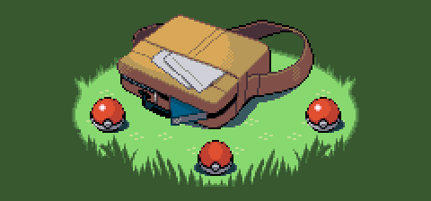

[Play my game!](https://yippptay.github.io/wow/)

# Pokemon

### Task List
- [x] Planned
- [x] Photoshop elements
- [X] Code
- [x] Finishing touches

### Features
- [x] Original damage formula for moves

- [x] Original pokemon stats
- [x] Original pokemon graphics

Using photoshop...

- [X] Timed text
- [X] Pokemon selection
- [X] Random pokemon battle
- [X] Animation
- [x] Plot
- [ ] Functioning healthbars
- [ ] Sound effects
- [ ] Exp
- [ ] More than one pokemon battles at once
- [ ] Functioning healthbars

### Credit
[Bytecamp](https://github.com/bytecampio) for giving me a good reference.
